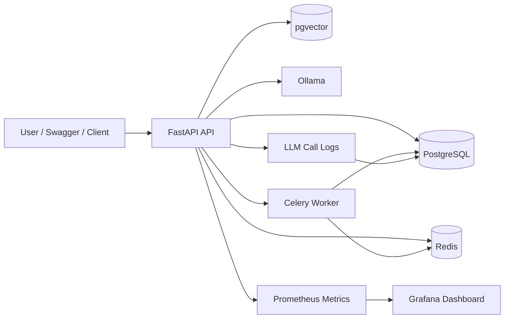

# FastAPI Starter: Personal Knowledge Base + Task Execution Agent

一个面向实习 / 校招场景打造的后端工程项目，目标不是“接个模型聊聊天”，而是完整展示：

- 标准后端工程能力：鉴权、数据库设计、接口分层、异常处理、测试
- AI 应用工程能力：LLM 接入、Tool Calling、RAG 知识库、异步文档处理
- 生产可运维能力：Prometheus、Grafana、Request ID、LLM 调用日志、成本统计

## 项目亮点
- `FastAPI + SQLAlchemy + PostgreSQL(pgvector)` 构建标准后端服务
- `JWT` 用户体系，支持注册、登录、权限校验
- `Celery + Redis` 支持异步任务处理
- `Ollama` 本地部署 `qwen2.5:3b` 与 `bge-m3`
- `RAG` 支持文档上传、切分、向量化、检索问答
- `Tool Calling` 支持天气查询、任务创建等工具调用
- `Prometheus + Grafana` 监控请求量、延迟与错误率
- `LLM Observability` 记录 prompt、response、token、耗时、工具调用链、错误原因

## 技术栈
- `FastAPI`
- `SQLAlchemy 2.x`
- `PostgreSQL + pgvector`
- `Redis`
- `Celery`
- `Ollama`
- `Prometheus`
- `Grafana`
- `Alembic`
- `Pytest`

## 架构图


## 核心模块
### 1. 用户与权限
- 注册 / 登录 / JWT 认证
- 用户状态校验
- 超级管理员权限扩展

### 2. 任务系统
- 任务创建、更新、删除、分页查询
- Tool Calling 可直接创建任务

### 3. RAG 知识库
- 上传 `.txt` 文档
- 文本切分与向量化
- 基于 `pgvector` 的相似度检索
- 问答结果附带引用片段

### 4. LLM 能力
- 统一 OpenAI 兼容适配层
- 本地 Ollama 模型切换
- Tool Calling 支持天气查询和任务创建

### 5. 可观测性
- `/metrics` 暴露 Prometheus 指标
- Grafana Dashboard 实时可视化
- Request ID 链路追踪
- LLM 调用日志与统计接口

## 目录结构
```text
app/
  api/          # 路由层
  core/         # 配置、日志、安全
  db/           # 数据库连接
  models/       # ORM 模型
  schemas/      # Pydantic 模型
  services/     # 业务逻辑层
  worker/       # Celery 任务
alembic/        # 数据库迁移
grafana/        # Grafana provisioning 与 dashboard
tests/          # Pytest 测试
scripts/        # 初始化脚本、评测脚本
```

## 一键启动
### 方式一：推荐
```bash
bash scripts/bootstrap_local.sh
```

这个脚本会自动完成：
- 复制 `.env.example` 为 `.env`
- 启动 `API / PostgreSQL / Redis / Celery / Ollama / Prometheus / Grafana`
- 拉取 `qwen2.5:3b` 与 `bge-m3`

说明：
- 当前 Dockerfile 默认使用可稳定访问的镜像代理源
- `api` 与 `celery_worker` 显式指定为 `linux/amd64`，这样在 Apple Silicon 机器上也能稳定运行

### 方式二：手动启动
```bash
cp .env.example .env
docker compose up -d --build
docker compose exec -T ollama ollama pull qwen2.5:3b
docker compose exec -T ollama ollama pull bge-m3
```

## 常用访问地址
- Swagger: `http://localhost:8000/docs`
- FastAPI Metrics: `http://localhost:8000/metrics`
- Prometheus: `http://localhost:9090`
- Grafana: `http://localhost:3000`

Grafana 默认账号密码：
- 用户名：`admin`
- 密码：`admin`

## Demo 展示建议
建议你后续在仓库中补一个 `docs/images/` 目录，并放入下面这些截图或 GIF：

- `swagger-overview.png`：Swagger 首页与接口列表
- `rag-query-demo.png`：上传文档后进行知识库问答的结果
- `grafana-dashboard.png`：Grafana 看板中展示请求量 / 延迟 / 错误率
- `tool-calling-task.gif`：通过聊天接口触发任务创建的完整过程

如果你准备投递实习，这几张图会比单纯的代码仓库更有说服力。

## 关键接口示例
### 1. 登录
```bash
curl -X POST "http://localhost:8000/api/auth/login" \
  -H "Content-Type: application/x-www-form-urlencoded" \
  -d "username=admin@example.com&password=password123"
```

### 2. AI 对话
```bash
curl -X POST "http://localhost:8000/api/chat/" \
  -H "Authorization: Bearer <TOKEN>" \
  -H "Content-Type: application/json" \
  -d '{"message":"帮我创建一个任务，标题是复习 RAG"}'
```

### 3. 上传知识库文档
```bash
curl -X POST "http://localhost:8000/api/rag/upload" \
  -H "Authorization: Bearer <TOKEN>" \
  -F "file=@sample_knowledge.txt"
```

### 4. 知识库问答
```bash
curl -X POST "http://localhost:8000/api/rag/query" \
  -H "Authorization: Bearer <TOKEN>" \
  -H "Content-Type: application/json" \
  -d '{"query":"这个项目的开发代号是什么？","top_k":2}'
```

### 5. LLM 统计接口
```bash
curl "http://localhost:8000/api/observability/llm-stats?days=7" \
  -H "Authorization: Bearer <TOKEN>"
```

## 可观测能力说明
### 请求级监控
- 通过 `prometheus-fastapi-instrumentator` 采集：
- 请求量
- 延迟
- 错误率
- 响应时间分布

### LLM 调用日志
当前会记录：
- `prompt`
- `response`
- `tool_calls`
- `prompt_tokens`
- `completion_tokens`
- `total_tokens`
- `latency_ms`
- `estimated_cost_usd`
- `status`
- `error_message`
- `request_id`

### 统计维度
- 按天统计
- 按用户统计
- 按接口统计

## 测试与验证
### 运行单元测试
```bash
pytest
```

### 运行 RAG 端到端测试
```bash
docker compose exec api python test_rag_live.py
```

### 运行 LLM 离线评测
```bash
docker compose exec api python scripts/eval_llm_observability.py
```

## 适合怎么写进简历
这个项目适合定位为：

- `后端开发（Python）`
- `AI 应用开发（LLM Agent）`

一句话总结：

> 基于 FastAPI、PostgreSQL、Redis、Celery 与 Ollama 构建个人知识库 + 任务执行 Agent，支持 JWT 鉴权、Tool Calling、RAG、异步文档处理，以及 Prometheus/Grafana/LLM 日志的生产级可观测能力。

更完整的简历描述见 [resume_project.md](file:///Users/gxyy/Documents/trae_projects/fastapi_starter/docs/resume_project.md)
最终压缩版见 [resume_project_final_short.md](file:///Users/gxyy/Documents/trae_projects/fastapi_starter/docs/resume_project_final_short.md)

## 后续可继续优化
- Chat / RAG 改造成流式输出
- 增加更多 Tool Calling 工具
- 扩充离线评测集与自动打分
- 增加 GitHub Actions CI
- 增加前端页面或 Demo GIF
