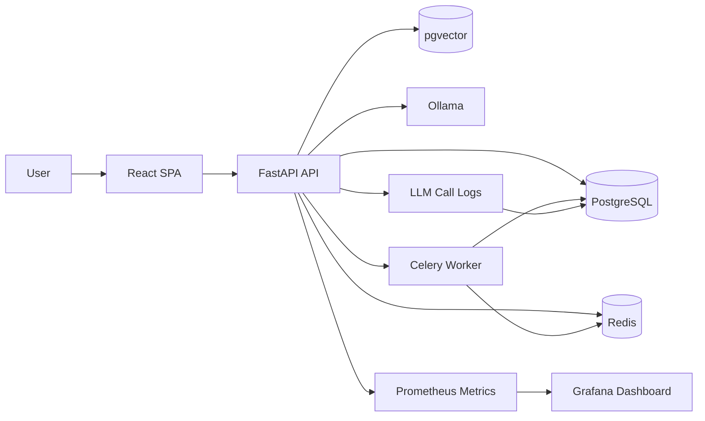
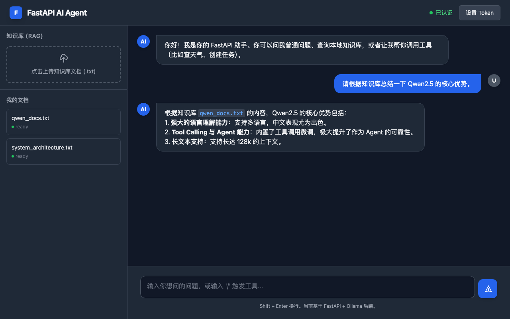

# FastAPI Starter: Personal Knowledge Base + Task Execution Agent

一个面向实习 / 校招场景打造的后端工程项目，目标不是“接个模型聊聊天”，而是完整展示：

- 标准后端工程能力：鉴权、数据库设计、接口分层、异常处理、测试
- AI 应用工程能力：LLM 接入、Tool Calling、RAG 知识库、真实异步文档处理
- 生产可运维能力：Prometheus、Grafana、Request ID、LLM 调用日志、成本统计

## 项目亮点
- `FastAPI + SQLAlchemy + PostgreSQL(pgvector)` 构建标准后端服务
- `JWT` 用户体系，支持注册、登录、权限校验与密码修改
- `Celery + Redis` 支持异步任务处理，`Flower` 可视化监控面板
- `Ollama` 本地部署 `qwen2.5:3b` 与 `bge-m3`
- `RAG` 支持 `.txt` / `.md` / `.pdf` 多格式文档上传，按用户隔离，异步切分与向量化
- `BGE-Reranker` 可选启用二次重排，提升知识库召回结果排序质量
- `Tool Calling` 支持 5 个工具（天气查询、创建任务、系统状态、任务列表、数学计算）
- `Multi-Tenant BYOK` 每个用户可独立配置自有大模型厂商与 API Key（Fernet 加密）
- `Prometheus + Grafana` 监控请求量、延迟与错误率，预置看板
- `LLM Observability` 记录 prompt、response、token、耗时、工具调用链、成本估算、错误原因
- `Redis 滑动窗口限流` 保护聊天接口，Redis 不可用时自动降级
- `SSE 流式输出` Chat 和 RAG 均支持 Server-Sent Events 流式响应
- `多轮对话记忆` RAG 支持 session_id 管理对话上下文
- `GitHub Actions CI` PostgreSQL 集成测试 + Docker 构建验证
- `121 个单元测试` + pre-commit hooks（ruff lint/format）
- **现代化 React SPA 前端**：8 个独立路由页面，覆盖聊天/知识库/任务/可观测性/设置/健康监控
- **SSE 流式渲染**：支持打字机效果的流式对话展示
- **全 Mock 模式**：无需后端即可独立开发调试
- **精致克制的前端设计**：双主题、JetBrains Mono + Plus Jakarta Sans 字体体系、三栏布局

## 技术栈
### 后端
- `FastAPI`
- `SQLAlchemy 2.x`
- `PostgreSQL + pgvector`
- `Redis`
- `Celery`
- `Ollama`
- `Prometheus`
- `Grafana`
- `Alembic`
- `Pytest`

### 前端
- `React 18+` + `TypeScript`（strict 模式）
- `Vite 8` 构建工具
- `Tailwind CSS v4` + `@tailwindcss/typography`
- `React Router v7` 客户端路由
- `Recharts` 可观测性图表
- `Axios` HTTP 客户端（含 Mock 拦截器）
- `react-markdown` + `remark-gfm` Markdown 渲染

## 架构图

```mermaid
flowchart LR
    U[User] --> FE[React SPA]
    FE --> API[FastAPI API]
    API --> DB[(PostgreSQL)]
    API --> V[(pgvector)]
    API --> R[(Redis)]
    API --> O[Ollama]
    API --> P[Prometheus Metrics]
    P --> G[Grafana Dashboard]
    API --> C[Celery Worker]
    C --> DB
    C --> R
    API --> L[LLM Call Logs]
    L --> DB
```

## 核心模块
### 1. 用户与权限
- 注册 / 登录 / JWT 认证
- 用户状态校验
- 超级管理员权限扩展

### 2. 任务系统
- 任务创建、更新、删除、分页查询
- Tool Calling 可直接创建任务

### 3. RAG 知识库
- 上传 `.txt` / `.md` / `.pdf` 多格式文档
- 文档按用户隔离存储
- Celery 异步执行文本切分与向量化
- 基于 `pgvector` 的余弦相似度检索
- 可选使用 `BGE-Reranker` 做二次重排
- 问答结果附带引用片段
- 支持 `session_id` 多轮对话上下文记忆

### 4. LLM 能力
- 统一 OpenAI 兼容适配层
- 本地 Ollama 或云端大模型灵活切换
- 多租户 BYOK：每个用户可独立配置自己的 LLM 服务商与 API Key
- Tool Calling 支持 5 个工具：天气查询、创建任务、系统状态、任务列表、数学计算
- 支持 SSE 流式输出

### 5. 可观测性
- `/metrics` 暴露 Prometheus 指标
- Grafana Dashboard 实时可视化
- Request ID 链路追踪（响应头 `X-Request-ID`）
- LLM 调用日志与多维统计（按天/端点/用户）
- 结构化 JSON 日志（可选）

### 6. 前端 SPA
- **登录/注册** — JWT Token 持久化，邮箱密码登录或直接粘贴 Token
- **AI 对话** — SSE 流式渲染、Markdown 展示、MessageList 自动滚动、Tool Calling 卡片
- **知识库管理** — 上传 `.txt/.md/.pdf`、文档状态指示灯、RAG 搜索查询
- **任务管理** — 状态过滤、点击切换状态（待办→进行中→已完成）、创建/删除
- **用户设置** — 多厂商 LLM 配置（OpenAI/DeepSeek/Ollama 等）、密码修改
- **可观测性面板** — 统计卡片、折线图（Calls/Token 趋势）、端点柱状图、LLM 调用日志详情 Modal
- **系统健康** — Database/Redis/Ollama 三服务状态灯、10 秒自动轮询
- **Mock 模式** — `VITE_USE_MOCK=true` 切换，全功能可离线演示

## 目录结构
```text
app/
  api/          # 路由层
  core/         # 配置、日志、安全
  db/           # 数据库连接
  models/       # ORM 模型
  schemas/      # Pydantic 模型
  services/     # 业务逻辑层
  worker/       # Celery 任务
alembic/        # 数据库迁移
frontend/       # React SPA 前端
  src/
    components/ # UI 组件（auth/chat/knowledge/tasks/observability/layout/ui）
    contexts/   # AuthContext, ThemeContext
    hooks/      # useChat 流式对话 Hook
    mock/       # Mock 数据层（全 API 覆盖）
    pages/      # 8 个路由页面
    services/   # 7 个 API Service 模块
    types/      # TypeScript 类型定义
grafana/        # Grafana provisioning 与 dashboard
tests/          # Pytest 测试
scripts/        # 初始化脚本、评测脚本
```

> **详细的模块架构与类说明，请参考 [CODE_WIKI.md](docs/CODE_WIKI.md)**

## 一键启动
### 方式一：推荐
```bash
bash scripts/bootstrap_local.sh
```

这个脚本会自动完成：
- 复制 `.env.example` 为 `.env`
- 启动 `API / PostgreSQL / Redis / Celery Worker / Ollama / Prometheus / Grafana / Flower`
- 拉取 `qwen2.5:3b` 与 `bge-m3`

说明：
- 当前 Dockerfile 默认使用可稳定访问的镜像代理源
- `api` 与 `celery_worker` 显式指定为 `linux/amd64`，这样在 Apple Silicon 机器上也能稳定运行

### 方式二：手动启动
```bash
cp .env.example .env
docker compose up -d --build
docker compose exec -T ollama ollama pull qwen2.5:3b
docker compose exec -T ollama ollama pull bge-m3
```

### 初始化种子数据（可选）
```bash
docker compose exec api python scripts/seed_demo_data.py
```
创建 demo 用户 (`demo@example.com` / `demo123456`) 和示例数据。

## 最近更新
- 新增**全功能 React SPA 前端**：8 个独立路由页面，覆盖聊天/知识库/任务/可观测性/设置/健康监控
- 前端支持** Mock 模式**（`VITE_USE_MOCK=true`），无需后端即可独立开发调试
- 前端集成 **Recharts 可观测性面板**：统计卡片、趋势折线图、端点柱状图、LLM 日志详情 Modal
- 前端采用**精致克制设计**：Plus Jakarta Sans + JetBrains Mono 字体、双主题 CSS 变量体系、抽屉式侧边栏
- 前端 **Service/Context/Hook 三层架构**：7 个 API Service、2 个 Context、1 个 useChat Hook
- 支持多格式文档上传（.txt / .md / .pdf），基于 `pypdf` 提取 PDF 文本
- RAG 支持 `session_id` 多轮对话上下文记忆（基于 Redis）
- RAG 检索和 Chat 均支持 SSE 流式输出
- 新增多租户 BYOK 架构：用户可独立配置 LLM 厂商与 API Key（Fernet 加密）
- 新增 API 路径版本化：全线迁移至 `/api/v1/...`
- 新增 Swagger OAuth2 自动获取 Token 功能，无需手动复制
- 新增 5 个 Tool Calling 工具（天气、创建任务、系统状态、任务列表、计算器）
- 新增 Redis ZSET 滑动窗口限流保护 + CORS 中间件
- 新增 Celery Flower 监控面板（端口 5555）
- 新增 GitHub Actions CI（PostgreSQL 集成测试 + Docker 构建）
- 新增 pre-commit hooks（ruff lint/format）与结构化 JSON 日志
- 新增健康检查增强（DB/Redis/Ollama 依赖探针）、密码修改接口、数据库备份恢复脚本、Locust 压力测试脚本
- 测试覆盖从 13 个扩充到 121 个单元测试 + e2e 验证脚本

详细改动见 [changes.md](docs/changes.md)

## 常用访问地址
- Swagger 文档 (深色模式): `http://localhost:8000/docs`
- FastAPI Metrics: `http://localhost:8000/metrics`
- 前端 SPA（开发模式）: `http://localhost:5173`（或 `--mode mock` 开启离线模式）
- 前端 SPA（Mock 模式）: 运行 `cd frontend && npx vite --host --mode mock`
- 前端 SPA（生产构建）: `http://localhost:8000/demo.html`（旧版轻量 Demo 页）
- Prometheus: `http://localhost:9090`
- Grafana: `http://localhost:3000`
- Flower (Celery 监控): `http://localhost:5555`

Grafana 默认账号密码：
- 用户名：`admin`
- 密码：`admin`

## 界面展示

### 1. 前端对话与知识库问答 (RAG)


### 2. Swagger 接口文档 (深色模式)


### 3. Grafana 监控大盘


## 关键接口示例
### 1. 登录
```bash
curl -X POST "http://localhost:8000/api/v1/auth/login" \
  -H "Content-Type: application/x-www-form-urlencoded" \
  -d "username=admin@example.com&password=password123"
```

### 2. AI 对话
```bash
curl -X POST "http://localhost:8000/api/v1/chat/" \
  -H "Authorization: Bearer <TOKEN>" \
  -H "Content-Type: application/json" \
  -d '{"message":"帮我创建一个任务，标题是复习 RAG"}'
```

### 3. 上传知识库文档
```bash
curl -X POST "http://localhost:8000/api/v1/rag/upload" \
  -H "Authorization: Bearer <TOKEN>" \
  -F "file=@sample_knowledge.txt"
```

返回示例：
```json
{
  "id": 1,
  "filename": "sample_knowledge.txt",
  "file_type": "txt",
  "status": "queued",
  "chunks_count": 0,
  "processing_task_id": "celery-task-id",
  "error_message": null,
  "created_at": "2026-05-04T12:00:00"
}
```

### 4. 知识库问答
```bash
curl -X POST "http://localhost:8000/api/v1/rag/query" \
  -H "Authorization: Bearer <TOKEN>" \
  -H "Content-Type: application/json" \
  -d '{"query":"这个项目的开发代号是什么？","top_k":2}'
```

### 5. 查看文档处理状态
```bash
curl "http://localhost:8000/api/v1/rag/documents/1" \
  -H "Authorization: Bearer <TOKEN>"
```

### 6. 重新提交文档处理任务
```bash
curl -X POST "http://localhost:8000/api/v1/worker/process" \
  -H "Authorization: Bearer <TOKEN>" \
  -H "Content-Type: application/json" \
  -d '{"document_id":1}'
```

### 7. LLM 统计接口
```bash
curl "http://localhost:8000/api/v1/observability/llm-stats?days=7" \
  -H "Authorization: Bearer <TOKEN>"
```

## 可观测能力说明
### 请求级监控
- 通过 `prometheus-fastapi-instrumentator` 采集：
- 请求量
- 延迟
- 错误率
- 响应时间分布

### LLM 调用日志
当前会记录：
- `prompt`
- `response`
- `tool_calls`
- `prompt_tokens`
- `completion_tokens`
- `total_tokens`
- `latency_ms`
- `estimated_cost_usd`
- `status`
- `error_message`
- `request_id`

### 统计维度
- 按天统计
- 按用户统计
- 按接口统计

## 测试与验证
### 运行单元测试（121 个）
```bash
python3 -m pytest -q
```

### 带覆盖率报告
```bash
python3 -m pytest --cov=app --cov-report=term-missing
```

### 运行端到端测试
```bash
docker compose exec api python scripts/e2e_test.py
```

### 运行 LLM 离线评测
```bash
docker compose exec api python scripts/eval_llm_observability.py
```

### 运行压力测试
```bash
locust -f scripts/locustfile.py --host=http://localhost:8000
```

## 适合怎么写进简历
这个项目适合定位为：

- `后端开发（Python）`
- `AI 应用开发（LLM Agent）`

一句话总结：

> 基于 FastAPI、PostgreSQL、Redis、Celery 与 Ollama 构建个人知识库 + 任务执行 Agent，支持 JWT 鉴权、Tool Calling、RAG、异步文档处理，以及 Prometheus/Grafana/LLM 日志的生产级可观测能力。

更完整的简历描述见 [resume_project.md](docs/resume_project.md)
最终压缩版见 [resume_project_final_short.md](docs/resume_project_final_short.md)

## 后续可继续优化
- 前端打包部署到 CDN（如 Vercel / Railway），实现后端分离部署
- 增加更多 Tool Calling 工具（如邮件发送、日历查询等）
- 扩充离线评测集与自动打分
- 录制完整的操作演示 GIF
- 云端正式部署（如 AWS / 阿里云 / Railway）
- 前端 i18n 国际化支持
- 前端 E2E 测试（Playwright）

## 维护约定
- 每次一轮实质性代码改动后，必须同步更新 `README.md`
- 每次都要在 `docs/changes.md` 追加一条记录，至少写明：目标、主要改动、验证方式、对应提交
- **AI 辅助开发**：本项目根目录包含 `CLAUDE.md` 文件，作为 AI Agent（如 Claude, Trae 等）的全局编码约束。使用 AI 辅助开发时，请确保 AI 工具已阅读并遵循该文件规范。
