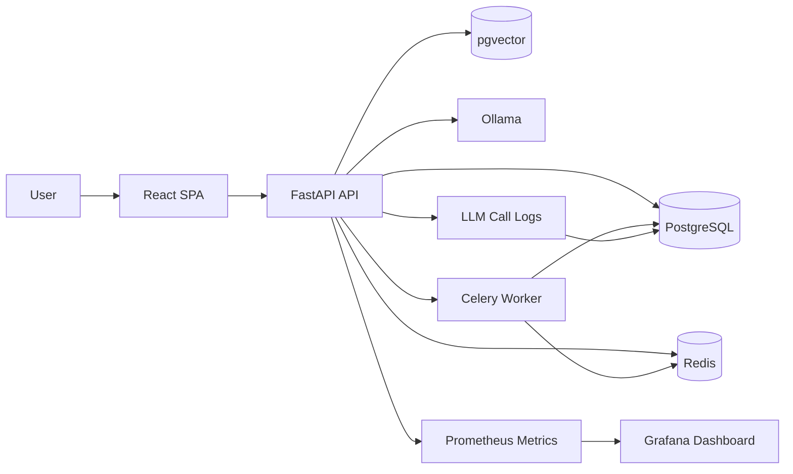

# FastAPI Starter — Full-Stack AI Agent System

[中文版 / Chinese](README.zh-CN.md)

A production-grade full-stack AI Agent system built with **FastAPI + React + PostgreSQL(pgvector) + Redis + Celery + Ollama**. Features JWT authentication, tenant-isolated RAG knowledge base, Tool Calling via MCP protocol, async document processing, and comprehensive observability.

## Highlights

- `FastAPI + SQLAlchemy + PostgreSQL(pgvector)` backend
- `JWT` auth with registration, login, permission checks, and password change
- `Celery + Redis` async task processing with `Flower` monitoring dashboard
- `Ollama` local deployment of `qwen2.5:3b` and `bge-m3`
- `RAG` supporting `.txt` / `.md` / `.pdf` uploads, tenant-isolated, async chunking & vectorization
- `BGE-Reranker` optional re-ranking for improved recall quality
- `Tool Calling` with 5 tools: weather, task creation, system status, task list, math calculator
- `Multi-Tenant BYOK` — each user configures their own LLM provider and API key (Fernet-encrypted)
- `Prometheus + Grafana` monitoring for request volume, latency, and error rate
- `LLM Observability` logging prompt, response, tokens, latency, tool calls, cost estimates, errors
- `Redis sliding-window rate limiting` on chat endpoints, graceful degradation on Redis failure
- `SSE streaming` for both Chat and RAG queries
- `Multi-turn conversation` — RAG supports session-based context via `session_id`
- `GitHub Actions CI` PostgreSQL integration tests + Docker build verification
- `129 unit tests` + pre-commit hooks (ruff lint/format)
- **Auto Mock mode** — no API Key? No problem. System auto-enables Mock mode when `LLM_API_KEY` is empty
- **`make setup` one-click start** — auto-generates SECRET_KEY, seeds demo data, pulls Ollama models
- **Docker Compose Profiles** — core 4 containers by default, `--profile full` adds Ollama, `--profile monitor` adds Grafana/Prometheus
- **Modern React SPA frontend** — 8 route pages covering chat, knowledge base, tasks, observability, settings, health
- **SSE streaming rendering** — typewriter-effect real-time chat display
- **Mock mode** — full offline development without a running backend
- **Refined minimal design** — dual theme, JetBrains Mono + Plus Jakarta Sans, three-column layout

## Tech Stack

### Backend
- `FastAPI`
- `SQLAlchemy 2.x`
- `PostgreSQL + pgvector`
- `Redis`
- `Celery`
- `Ollama`
- `Prometheus`
- `Grafana`
- `Alembic`
- `Pytest`

### Frontend
- `React 19` + `TypeScript` (strict mode)
- `Vite 8`
- `Tailwind CSS v4` + `@tailwindcss/typography`
- `React Router v7`
- `Recharts`
- `Axios` (with Mock interceptor)
- `react-markdown` + `remark-gfm`

## Architecture


```mermaid
flowchart LR
    U[User] --> FE[React SPA]
    FE --> API[FastAPI API]
    API --> DB[(PostgreSQL)]
    API --> V[(pgvector)]
    API --> R[(Redis)]
    API --> O[Ollama]
    API --> P[Prometheus Metrics]
    P --> G[Grafana Dashboard]
    API --> C[Celery Worker]
    C --> DB
    C --> R
    API --> L[LLM Call Logs]
    L --> DB
```

## Core Modules

### 1. Auth & Users
- Register / Login / JWT authentication
- Active user verification
- Superuser permission escalation

### 2. Task System
- Create, update, delete, paginated list
- Tool Calling can directly create tasks

### 3. RAG Knowledge Base
- Upload `.txt` / `.md` / `.pdf` documents
- Tenant-isolated document storage
- Celery async text chunking and vectorization
- Cosine similarity search via `pgvector`
- Optional `BGE-Reranker` cross-encoder re-ranking
- Answers include source citations
- `session_id` multi-turn conversation memory

### 4. LLM & Agent
- Unified OpenAI-compatible adapter layer
- Seamless switching between local Ollama and cloud LLMs
- Multi-Tenant BYOK: each user configures their own LLM provider & API key
- 5 tools: weather lookup, task creation, system status, task listing, math calculator
- SSE streaming output

### 5. Observability
- `/metrics` exposes Prometheus metrics
- Grafana Dashboard real-time visualization
- Request ID tracing (`X-Request-ID` response header)
- LLM call logging with multi-dimensional stats (by day / endpoint / user)
- Structured JSON logging (optional)

### 6. Frontend SPA
- **Auth** — JWT persistence, login with email/password or paste token directly
- **Chat** — SSE streaming, Markdown rendering, auto-scroll, ToolCallCard visualization
- **Knowledge Base** — upload .txt/.md/.pdf, document status indicators, RAG search
- **Tasks** — status filter, click-to-cycle (pending→in-progress→done), create/delete
- **Settings** — multi-provider LLM config (OpenAI/DeepSeek/Ollama etc.), password change
- **Observability** — stat cards, line charts (calls/tokens), endpoint bar chart, LLM log detail modal
- **Health** — Database/Redis/Ollama status lights, 10s auto-polling
- **Mock Mode** — `VITE_USE_MOCK=true` for offline full-feature demo

## Directory Structure

```text
app/
  api/          # Route layer
  core/         # Config, logging, security
  db/           # Database connection
  models/       # ORM models
  schemas/      # Pydantic schemas
  services/     # Business logic layer
  worker/       # Celery tasks
alembic/        # Database migrations
frontend/       # React SPA
  src/
    components/ # UI components (auth/chat/knowledge/tasks/observability/layout/ui)
    contexts/   # AuthContext, ThemeContext
    hooks/      # useChat SSE streaming hook
    mock/       # Mock data layer (full API coverage)
    pages/      # 8 route pages
    services/   # 7 API service modules
    types/      # TypeScript type definitions
grafana/        # Grafana provisioning & dashboards
tests/          # Pytest unit tests
scripts/        # Bootstrap & eval scripts
```

> **Detailed architecture and class docs: [CODE_WIKI.md](docs/CODE_WIKI.md)**

## Quick Start

### Option 1: One-click (recommended)

```bash
make setup
```

This script automatically:
- Copies `.env.example` to `.env` and generates a random `SECRET_KEY`
- Starts core services (API + PostgreSQL + Redis + Celery Worker)
- Waits for API to be healthy, then seeds demo data
- Checks Ollama availability and pulls `bge-m3` if running
- **No API Key required** — Mock mode auto-enables when `LLM_API_KEY` is empty

### Option 2: Manual

```bash
cp .env.example .env
# Edit .env: set LLM_API_KEY or leave empty for Mock mode
docker compose up -d --build
```

### Start optional services

```bash
# Add Ollama for RAG (document vectorization)
docker compose --profile full up -d

# Add monitoring (Prometheus + Grafana + Flower)
docker compose --profile monitor up -d

# Full stack (all services)
docker compose --profile full --profile monitor up -d
```

### Makefile commands

```bash
make help          # Show all commands
make setup         # First-time setup (init .env + start + seed)
make up            # Start core services
make up-full       # Start with Ollama + monitoring
make down          # Stop all services
make logs          # View API logs
make seed          # Seed demo data
make test          # Run pytest
make ollama-pull   # Pull Ollama models
make shell         # Enter API container shell
make clean         # Remove containers + volumes
```

### Demo account

```bash
make seed
# Email: demo@example.com  Password: demo123456
```

### Use pre-built Docker image

```bash
# Pull from GitHub Container Registry
docker pull ghcr.io/idkhgxyy/fastapi_starter:main

# Run with Docker Compose (edit docker-compose.yml to use the pre-built image)
```

## Access URLs

| Entry | URL | Notes |
|-------|-----|-------|
| Swagger Docs (dark mode) | `http://localhost:8000/docs` | OAuth2 auto-login |
| FastAPI Metrics | `http://localhost:8000/metrics` | Prometheus endpoint |
| Frontend SPA (dev) | `http://localhost:5173` | `cd frontend && npm run dev` |
| Frontend SPA (mock) | `http://localhost:5173` | `cd frontend && npx vite --host --mode mock` |
| Legacy Demo Page | `http://localhost:8000/demo.html` | Lightweight HTML demo |
| Prometheus | `http://localhost:9090` | Metrics explorer |
| Grafana | `http://localhost:3000` | admin / admin |
| Flower | `http://localhost:5555` | Celery monitoring |

## Screenshots

### Chat & Sidebar
| Chat | Knowledge Base | Tasks |
|:---:|:---:|:---:|
|  |  |  |

### Observability & Settings
| LLM Monitoring | Health | Settings |
|:---:|:---:|:---:|
|  |  |  |

### API Docs & Grafana
| Swagger | Grafana |
|:---:|:---:|
|  |  |

## API Examples

### 1. Login

```bash
curl -X POST "http://localhost:8000/api/v1/auth/login" \
  -H "Content-Type: application/x-www-form-urlencoded" \
  -d "username=admin@example.com&password=password123"
```

### 2. AI Chat

```bash
curl -X POST "http://localhost:8000/api/v1/chat/" \
  -H "Authorization: Bearer <TOKEN>" \
  -H "Content-Type: application/json" \
  -d '{"message":"Create a task titled Review RAG"}'
```

### 3. Upload Document

```bash
curl -X POST "http://localhost:8000/api/v1/rag/upload" \
  -H "Authorization: Bearer <TOKEN>" \
  -F "file=@sample_knowledge.txt"
```

Response:

```json
{
  "id": 1,
  "filename": "sample_knowledge.txt",
  "file_type": "txt",
  "status": "queued",
  "chunks_count": 0,
  "processing_task_id": "celery-task-id",
  "error_message": null,
  "created_at": "2026-05-04T12:00:00"
}
```

### 4. RAG Query

```bash
curl -X POST "http://localhost:8000/api/v1/rag/query" \
  -H "Authorization: Bearer <TOKEN>" \
  -H "Content-Type: application/json" \
  -d '{"query":"What is the project codename?","top_k":2}'
```

### 5. Document Status

```bash
curl "http://localhost:8000/api/v1/rag/documents/1" \
  -H "Authorization: Bearer <TOKEN>"
```

### 6. Reprocess Document

```bash
curl -X POST "http://localhost:8000/api/v1/worker/process" \
  -H "Authorization: Bearer <TOKEN>" \
  -H "Content-Type: application/json" \
  -d '{"document_id":1}'
```

### 7. LLM Stats

```bash
curl "http://localhost:8000/api/v1/observability/llm-stats?days=7" \
  -H "Authorization: Bearer <TOKEN>"
```

## Observability

### API Monitoring

Collected via `prometheus-fastapi-instrumentator`:
- Request volume
- Latency distribution
- Error rate
- Response time percentiles

### LLM Call Logging

Each LLM invocation records:
- `prompt` / `response` / `tool_calls`
- `prompt_tokens` / `completion_tokens` / `total_tokens`
- `latency_ms` / `estimated_cost_usd`
- `status` / `error_message`
- `request_id` for distributed tracing

### Aggregation Dimensions
- By day
- By user
- By API endpoint

## Testing

```bash
# Run all 129 unit tests
python3 -m pytest -q

# With coverage report
python3 -m pytest --cov=app --cov-report=term-missing

# E2E test
docker compose exec api python scripts/e2e_test.py

# LLM offline eval
docker compose exec api python scripts/eval_llm_observability.py

# Load test
locust -f scripts/locustfile.py --host=http://localhost:8000
```

## About This Project

This project demonstrates end-to-end implementation of an AI Agent system — from authentication and data modeling to RAG retrieval pipelines, tool-calling agents, async task queues, and production observability.

Key capabilities:
- **Backend**: FastAPI layered architecture (Router → Service → Model), SQLAlchemy 2.0, Alembic migrations
- **AI Integration**: Ollama / OpenAI-compatible APIs, 5 MCP-registered tools, agentic multi-round conversation
- **RAG Pipeline**: Multi-format document ingestion, pgvector cosine search, optional BGE-Reranker
- **Frontend**: React SPA with SSE streaming chat, Recharts observability dashboards, Mock mode
- **DevOps**: Docker Compose (8 services), GitHub Actions CI, Prometheus + Grafana, LLM call logging
- **Security**: JWT + bcrypt auth, Fernet-encrypted API keys, Redis sliding-window rate limiting, tenant data isolation

Detailed architecture, module documentation, and migration history: [docs/](docs/)
