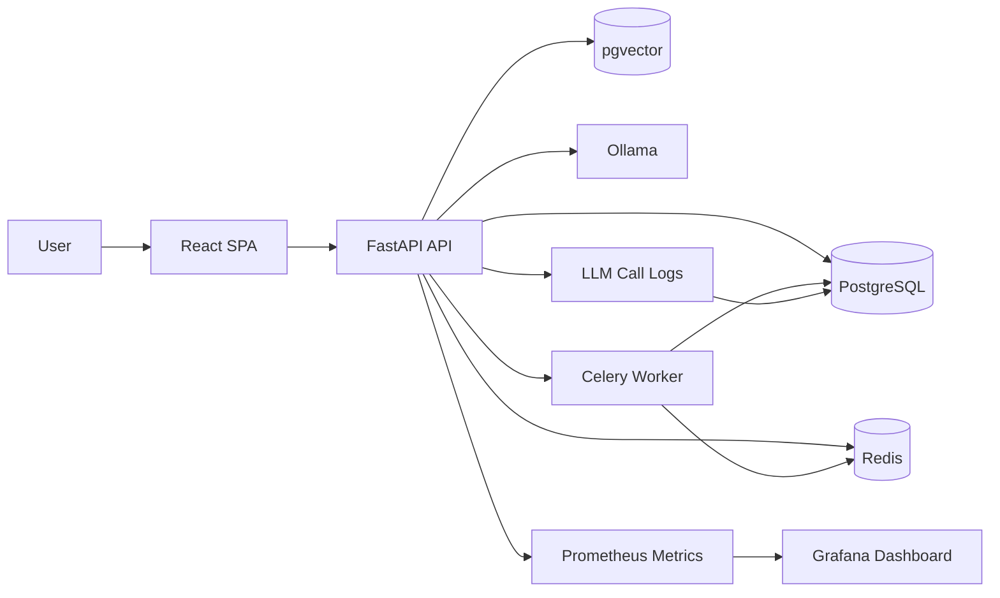
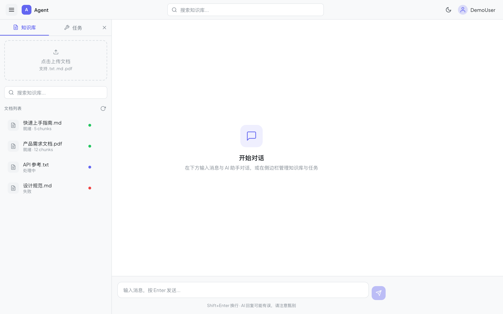
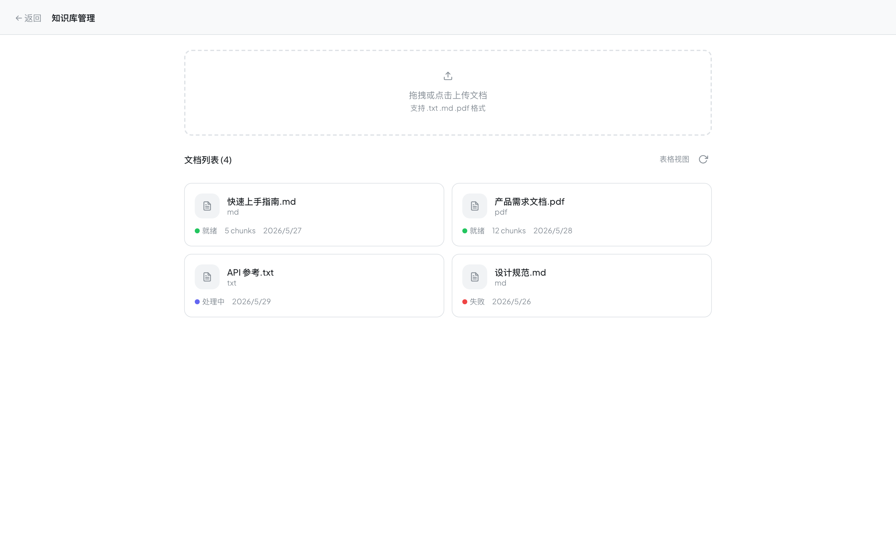
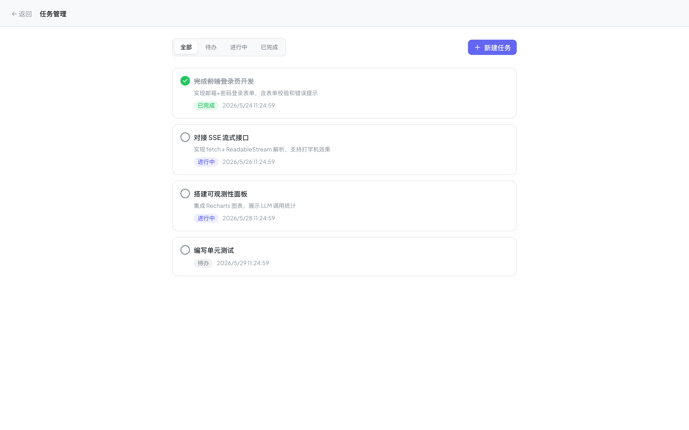
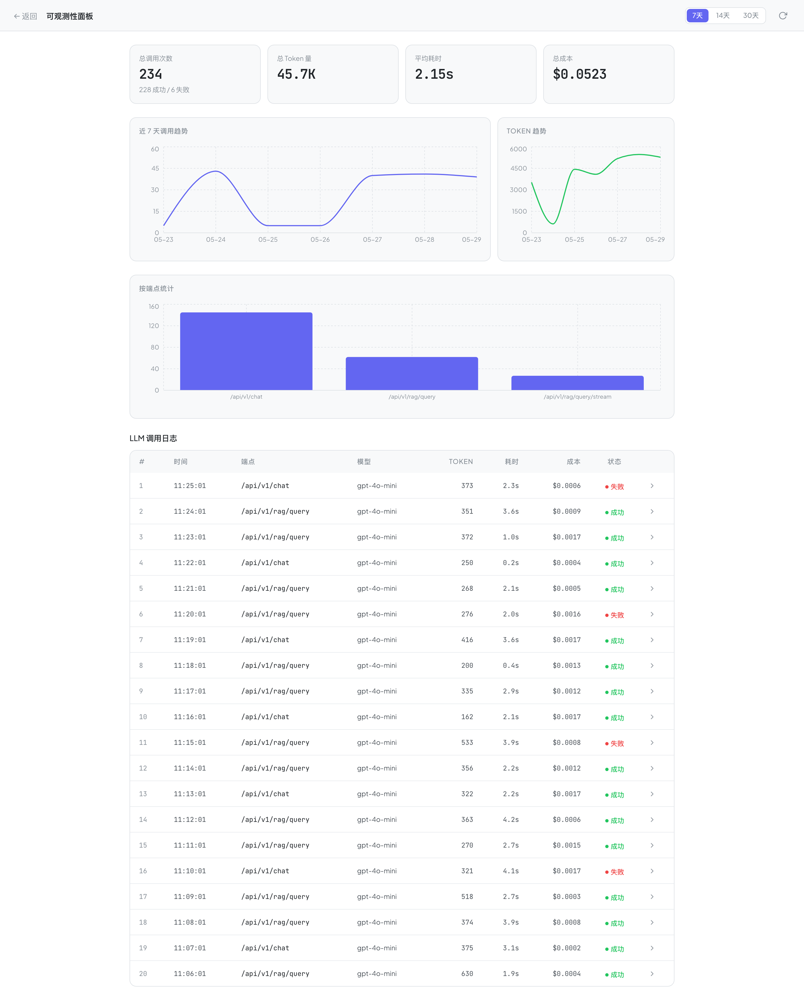
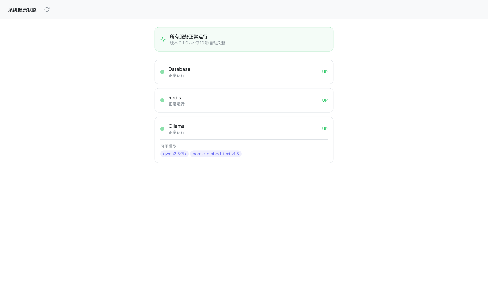
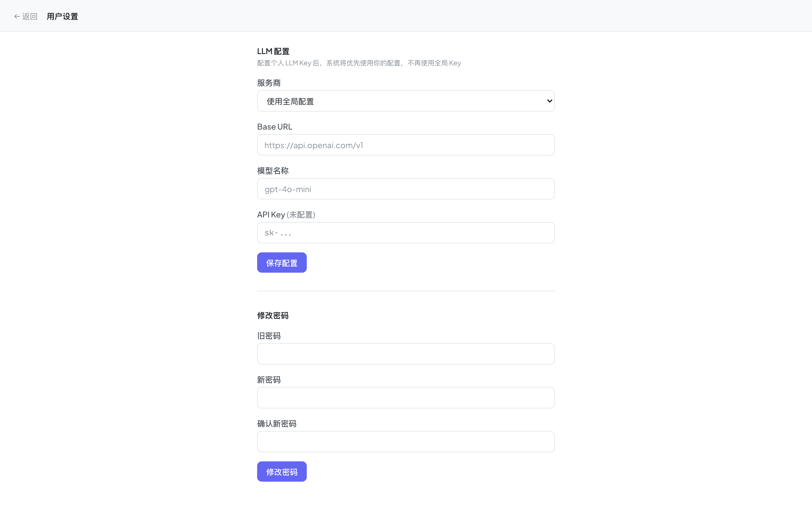
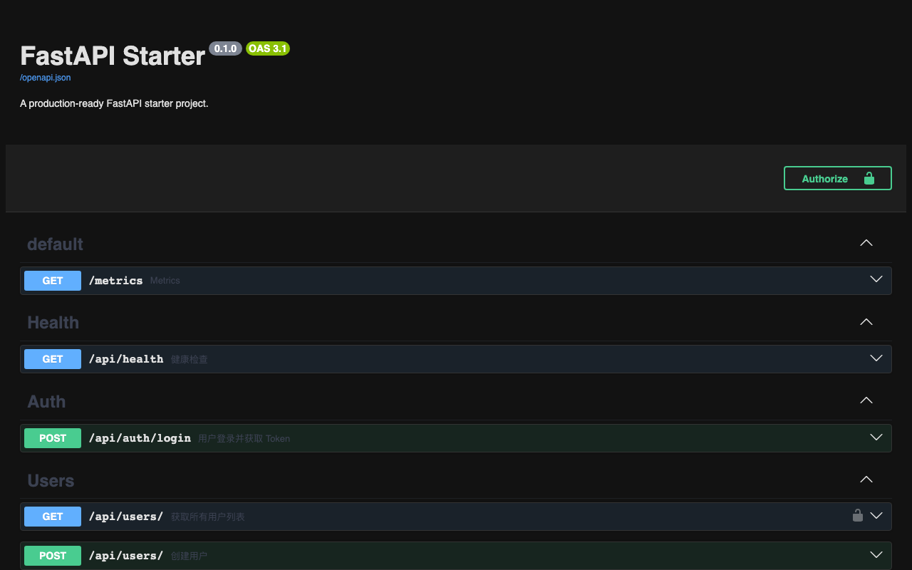
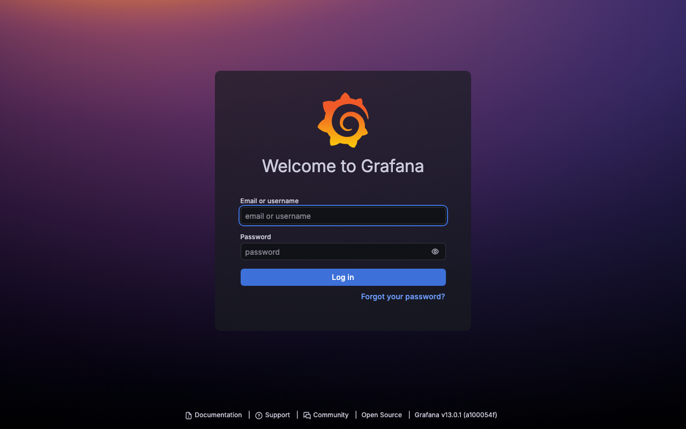

# FastAPI Starter — 全栈 AI Agent 系统

[English version / 英文版](README.md)

基于 **FastAPI + React + PostgreSQL(pgvector) + Redis + Celery + Ollama** 构建的生产级全栈 AI Agent 系统。支持 JWT 鉴权、租户隔离的 RAG 知识库、MCP 协议 Tool Calling、异步文档处理与全方位可观测性。

## 项目亮点

- `FastAPI + SQLAlchemy + PostgreSQL(pgvector)` 构建标准后端服务
- `JWT` 用户体系，支持注册、登录、权限校验与密码修改
- `Celery + Redis` 支持异步任务处理，`Flower` 可视化监控面板
- `Ollama` 本地部署 `qwen2.5:3b` 与 `bge-m3`
- `RAG` 支持 `.txt` / `.md` / `.pdf` 多格式文档上传，按用户隔离，异步切分与向量化
- `BGE-Reranker` 可选启用二次重排，提升知识库召回结果排序质量
- `Tool Calling` 支持 5 个工具（天气查询、创建任务、系统状态、任务列表、数学计算器）
- `Multi-Tenant BYOK` 每个用户可独立配置自有大模型厂商与 API Key（Fernet 加密）
- `Prometheus + Grafana` 监控请求量、延迟与错误率，预置看板
- `LLM Observability` 记录 prompt、response、token、耗时、工具调用链、成本估算、错误原因
- `Redis 滑动窗口限流` 保护聊天接口，Redis 不可用时自动降级
- `SSE 流式输出` Chat 和 RAG 均支持 Server-Sent Events 流式响应
- `多轮对话记忆` RAG 支持 session_id 管理对话上下文
- `GitHub Actions CI` PostgreSQL 集成测试 + Docker 构建验证
- `129 个单元测试` + pre-commit hooks（ruff lint/format）
- **Mock 模式自动启用** — 无需 API Key，`LLM_API_KEY` 为空时自动切换 Mock 模式
- **`make setup` 一键启动** — 自动生成 SECRET_KEY、灌入 demo 数据、拉取 Ollama 模型
- **Docker Compose Profile 分层** — 核心 4 容器默认启动，`--profile full` 加 Ollama，`--profile monitor` 加监控
- **现代化 React SPA 前端** — 8 个独立路由页面，覆盖聊天、知识库、任务、可观测性、设置、健康监控
- **SSE 流式渲染** — 支持打字机效果的流式对话展示
- **全 Mock 模式** — 无需后端即可独立开发调试
- **精致克制的前端设计** — 双主题、JetBrains Mono + Plus Jakarta Sans 字体体系、三栏布局

## 技术栈

### 后端
- `FastAPI`
- `SQLAlchemy 2.x`
- `PostgreSQL + pgvector`
- `Redis`
- `Celery`
- `Ollama`
- `Prometheus`
- `Grafana`
- `Alembic`
- `Pytest`

### 前端
- `React 19` + `TypeScript`（strict 模式）
- `Vite 8`
- `Tailwind CSS v4` + `@tailwindcss/typography`
- `React Router v7`
- `Recharts`
- `Axios`（含 Mock 拦截器）
- `react-markdown` + `remark-gfm`

## 架构图



## 核心模块

### 1. 用户与权限
- 注册 / 登录 / JWT 认证
- 用户状态校验
- 超级管理员权限扩展

### 2. 任务系统
- 任务创建、更新、删除、分页查询
- Tool Calling 可直接创建任务

### 3. RAG 知识库
- 上传 `.txt` / `.md` / `.pdf` 多格式文档
- 文档按用户隔离存储
- Celery 异步执行文本切分与向量化
- 基于 `pgvector` 的余弦相似度检索
- 可选使用 `BGE-Reranker` 做二次重排
- 问答结果附带引用片段
- 支持 `session_id` 多轮对话上下文记忆

### 4. LLM 与 Agent
- 统一 OpenAI 兼容适配层
- 本地 Ollama 或云端大模型灵活切换
- 多租户 BYOK：每个用户可独立配置自己的 LLM 服务商与 API Key
- 5 个工具：天气查询、创建任务、系统状态、任务列表、数学计算器
- 支持 SSE 流式输出

### 5. 可观测性
- `/metrics` 暴露 Prometheus 指标
- Grafana Dashboard 实时可视化
- Request ID 链路追踪（响应头 `X-Request-ID`）
- LLM 调用日志与多维统计（按天 / 端点 / 用户）
- 结构化 JSON 日志（可选）

### 6. 前端 SPA
- **登录/注册** — JWT Token 持久化，邮箱密码登录或直接粘贴 Token
- **AI 对话** — SSE 流式渲染、Markdown 展示、MessageList 自动滚动、Tool Calling 卡片
- **知识库管理** — 上传 `.txt/.md/.pdf`、文档状态指示灯、RAG 搜索查询
- **任务管理** — 状态过滤、点击切换状态（待办→进行中→已完成）、创建/删除
- **用户设置** — 多厂商 LLM 配置（OpenAI/DeepSeek/Ollama 等）、密码修改
- **可观测性面板** — 统计卡片、折线图（Calls/Token 趋势）、端点柱状图、LLM 调用日志详情 Modal
- **系统健康** — Database/Redis/Ollama 三服务状态灯、10 秒自动轮询
- **Mock 模式** — `VITE_USE_MOCK=true` 切换，全功能可离线演示

## 目录结构

```text
app/
  api/          # 路由层
  core/         # 配置、日志、安全
  db/           # 数据库连接
  models/       # ORM 模型
  schemas/      # Pydantic 模型
  services/     # 业务逻辑层
  worker/       # Celery 任务
alembic/        # 数据库迁移
frontend/       # React SPA 前端
  src/
    components/ # UI 组件（auth/chat/knowledge/tasks/observability/layout/ui）
    contexts/   # AuthContext, ThemeContext
    hooks/      # useChat 流式对话 Hook
    mock/       # Mock 数据层（全 API 覆盖）
    pages/      # 8 个路由页面
    services/   # 7 个 API Service 模块
    types/      # TypeScript 类型定义
grafana/        # Grafana provisioning 与 dashboard
tests/          # Pytest 测试
scripts/        # 初始化脚本、评测脚本
```

> **详细的模块架构与类说明，请参考 [CODE_WIKI.md](docs/CODE_WIKI.md)**

## 一键启动

### 方式一：推荐

```bash
make setup
```

这个脚本会自动完成：
- 复制 `.env.example` 为 `.env`，并自动生成随机 `SECRET_KEY`
- 启动核心服务（API + PostgreSQL + Redis + Celery Worker）
- 等待 API 就绪后自动灌入 demo 数据
- 检测 Ollama 可用性，如运行则拉取 `bge-m3` 模型
- **无需 API Key** — `LLM_API_KEY` 为空时自动启用 Mock 模式

### 方式二：手动启动

```bash
cp .env.example .env
# 编辑 .env：设置 LLM_API_KEY，或留空使用 Mock 模式
docker compose up -d --build
```

### 启动可选服务

```bash
# 加上 Ollama（RAG 文档向量化需要）
docker compose --profile full up -d

# 加上监控（Prometheus + Grafana + Flower）
docker compose --profile monitor up -d

# 完整全栈（所有服务）
docker compose --profile full --profile monitor up -d
```

### Makefile 常用命令

```bash
make help          # 查看所有命令
make setup         # 首次安装（初始化 .env + 启动 + 灌数据）
make up            # 启动核心服务
make up-full       # 启动全部服务（含 Ollama + 监控）
make down          # 停止所有服务
make logs          # 查看 API 日志
make seed          # 灌入 demo 数据
make test          # 运行 pytest
make ollama-pull   # 拉取 Ollama 模型
make shell         # 进入 API 容器
make clean         # 清理容器和数据卷
```

### Demo 账号

```bash
make seed
# 邮箱: demo@example.com  密码: demo123456
```

## 常用访问地址

| 入口 | 地址 | 说明 |
|------|------|------|
| Swagger 文档（深色模式）| `http://localhost:8000/docs` | OAuth2 自动获取 Token |
| FastAPI Metrics | `http://localhost:8000/metrics` | Prometheus 指标端点 |
| 前端 SPA（开发模式）| `http://localhost:5173` | `cd frontend && npm run dev` |
| 前端 SPA（Mock 模式）| `http://localhost:5173` | `cd frontend && npx vite --host --mode mock` |
| 旧版 Demo 页面 | `http://localhost:8000/demo.html` | 轻量 HTML Demo |
| Prometheus | `http://localhost:9090` | 指标查询 |
| Grafana | `http://localhost:3000` | admin / admin |
| Flower | `http://localhost:5555` | Celery 任务监控 |

## 界面展示

### AI 对话与侧边栏
| 对话界面 | 知识库管理 | 任务管理 |
|:---:|:---:|:---:|
|  |  |  |

### 可观测性面板与系统监控
| LLM 调用监控 | 系统健康 | 用户设置 |
|:---:|:---:|:---:|
|  |  |  |

### Swagger 接口文档与 Grafana 监控大盘
| Swagger API 文档 | Grafana Dashboard |
|:---:|:---:|
|  |  |

## 关键接口示例

### 1. 登录

```bash
curl -X POST "http://localhost:8000/api/v1/auth/login" \
  -H "Content-Type: application/x-www-form-urlencoded" \
  -d "username=admin@example.com&password=password123"
```

### 2. AI 对话

```bash
curl -X POST "http://localhost:8000/api/v1/chat/" \
  -H "Authorization: Bearer <TOKEN>" \
  -H "Content-Type: application/json" \
  -d '{"message":"帮我创建一个任务，标题是复习 RAG"}'
```

### 3. 上传知识库文档

```bash
curl -X POST "http://localhost:8000/api/v1/rag/upload" \
  -H "Authorization: Bearer <TOKEN>" \
  -F "file=@sample_knowledge.txt"
```

返回示例：

```json
{
  "id": 1,
  "filename": "sample_knowledge.txt",
  "file_type": "txt",
  "status": "queued",
  "chunks_count": 0,
  "processing_task_id": "celery-task-id",
  "error_message": null,
  "created_at": "2026-05-04T12:00:00"
}
```

### 4. 知识库问答

```bash
curl -X POST "http://localhost:8000/api/v1/rag/query" \
  -H "Authorization: Bearer <TOKEN>" \
  -H "Content-Type: application/json" \
  -d '{"query":"这个项目的开发代号是什么？","top_k":2}'
```

### 5. 查看文档处理状态

```bash
curl "http://localhost:8000/api/v1/rag/documents/1" \
  -H "Authorization: Bearer <TOKEN>"
```

### 6. 重新提交文档处理任务

```bash
curl -X POST "http://localhost:8000/api/v1/worker/process" \
  -H "Authorization: Bearer <TOKEN>" \
  -H "Content-Type: application/json" \
  -d '{"document_id":1}'
```

### 7. LLM 统计接口

```bash
curl "http://localhost:8000/api/v1/observability/llm-stats?days=7" \
  -H "Authorization: Bearer <TOKEN>"
```

## 可观测能力说明

### 请求级监控

通过 `prometheus-fastapi-instrumentator` 采集：
- 请求量
- 延迟分布
- 错误率
- 响应时间分位数

### LLM 调用日志

每次 LLM 调用会记录：
- `prompt` / `response` / `tool_calls`
- `prompt_tokens` / `completion_tokens` / `total_tokens`
- `latency_ms` / `estimated_cost_usd`
- `status` / `error_message`
- `request_id`（分布式链路追踪）

### 统计维度
- 按天统计
- 按用户统计
- 按接口统计

## 测试与验证

```bash
# 运行全部 129 个单元测试
python3 -m pytest -q

# 带覆盖率报告
python3 -m pytest --cov=app --cov-report=term-missing

# 端到端测试
docker compose exec api python scripts/e2e_test.py

# LLM 离线评测
docker compose exec api python scripts/eval_llm_observability.py

# 压力测试
locust -f scripts/locustfile.py --host=http://localhost:8000
```

## 关于本项目

本项目实现了 AI Agent 系统的端到端工程化落地——从鉴权与数据建模，到 RAG 检索管线、Tool Calling Agent、异步任务队列，再到生产级可观测性。

核心能力：
- **后端**：FastAPI 分层架构（Router → Service → Model），SQLAlchemy 2.0，Alembic 迁移
- **AI 集成**：Ollama / OpenAI 兼容 API，5 个 MCP 注册工具，Agent 式多轮对话
- **RAG 管线**：多格式文档接入，pgvector 余弦检索，可选 BGE-Reranker 重排
- **前端**：React SPA，SSE 流式聊天，Recharts 可观测面板，Mock 离线模式
- **DevOps**：Docker Compose（8 个服务），GitHub Actions CI，Prometheus + Grafana，LLM 调用日志
- **安全**：JWT + bcrypt 鉴权，Fernet 加密 API Key，Redis 滑动窗口限流，租户数据隔离

详细架构、模块文档与变更历史：[docs/](docs/)
